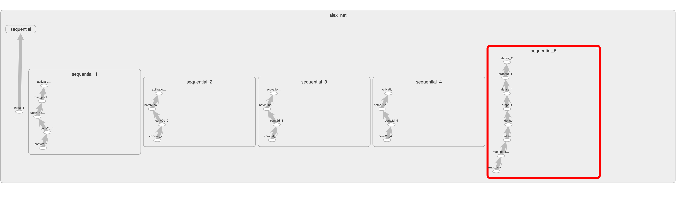
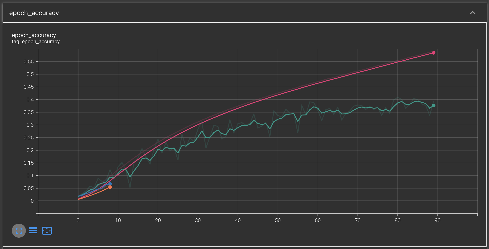
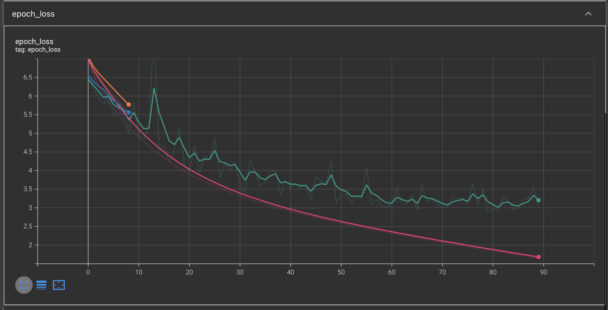

# AlexNet
**Paper**: [ImageNet Classification with Deep Convolutional Neural Networks](https://proceedings.neurips.cc/paper_files/paper/2012/file/c399862d3b9d6b76c8436e924a68c45b-Paper.pdf)</br>
**Dataset**: [ImageNet Kaggle Dataset](https://www.kaggle.com/competitions/imagenet-object-localization-challenge)</br>
**Architecture**:
The architecture differ from what have been written to the paper above. The graph of the model is:</br>



Architecture is fully compatible with TPU and can be compiled to EdgeTPU format.

Before training run:
```
pip install -r requirements.txt
```

When training, model will log everything to "logs/fit" folder. Anytime you can run `TensorBoard` by:
```
tensorboard --logdir ./logs/fit --port 8081
```

## CLI explanation

You can train network by using Command-Line Interface. For now the following commands are compatible:</br>
<table>
    <tr>
        <th>Command names</th>
        <th>Default value</th>
        <th>Explanation</th>
    </tr>
    <tr>
        <td>-i, --input-shape</td>
        <td>256</td>
        <td>Flag defines the size of the image. If you entered 100, then the size of an input model expect will be (100, 100). Model compatible with squared images only (in the future all rectangle images may be supported.)</td> 
    </tr>
    <tr>
        <td>-b, --batch_size</td>
        <td>128</td>
        <td>Flag defines the minibatch size.</td> 
    </tr>
    <tr>
        <td>-e, --epochs</td>
        <td>90</td>
        <td>Flag defines the number of epochs model will train.</td> 
    </tr>
    <tr>
        <td>-p, --path_data</td>
        <td>None</td>
        <td>Flag defines the path to the dataset itself. For example: path_to_some_folder/ILSVRC</td> 
    </tr>
    <tr>
        <td>-m, --model_path</td>
        <td>None</td>
        <td>If specified model will start training with pretrained weights.</td> 
    </tr>
    <tr>
        <td>-v, --validate</td>
        <td>False</td>
        <td>If this flag is set to True the model will validate itself in at the end of each epoch.</td> 
    </tr>
</table>

## Training

While training model saves the best results to the folder "checkpoint" and the intermediate result for each epoch in the folder "checkpoints-trimmed". Intermediate result is not full model, but only feature extraction part (without dense layers).

Without augmentation and specific tuning of hyperparameters, such as SGD learning rate model reached ~40% accuracy on validation dataset:

Accuracy:


Loss:
